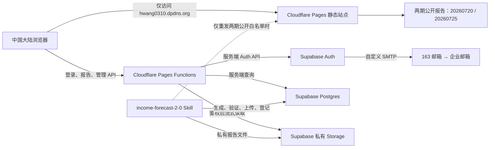

# 收入预估登录管理、私有报告与发布兼容设计

- 日期：2026-08-04
- 状态：完整设计已由用户确认，等待书面规格复核
- 适用站点：`https://hwang0310.dpdns.org/`
- 收入预估入口：`https://hwang0310.dpdns.org/projects/income-forecast/`

## 1. 背景与目标

收入预估报告目前随个人网站一起作为 Cloudflare Pages 静态文件发布。任何知道报告路径的人都能直接访问，同时现有 `income-forecast-2-0` Skill 在发布报告时会重新构建并部署完整网站。新方案需要在不改变报告固定网址和报告内部交互的前提下，为收入预估项目增加人员登录、权限管理和私有报告存储，并确保以后频繁调用 Skill 发布新报告时不会覆盖个人主页或把受保护报告重新公开。

本项目同时完成一项独立但很小的主页排版调整：把现有座右铭和毛泽东图片模块移到联系方式模块之前。座右铭文字、图片和其他主页内容不变。

### 1.1 成功标准

1. 未登录访客只能浏览项目介绍，以及 `20260720`、`20260725` 两期永久公开示例。
2. 名单中的有效用户用手机号和密码登录后可以浏览全部在线报告。
3. 王昊拥有最高管理员权限，可以维护人员、报告、置顶状态和审计信息，但不能查看任何人的密码。
4. 忘记密码通过名单中的企业邮箱完成，不使用付费短信，也不依赖中国大陆访问不稳定的前端第三方验证资源。
5. 受保护报告不出现在 Cloudflare Pages 的公开静态构建中；仅由同域 Cloudflare 服务端验证身份后从 Supabase 私有存储读取。
6. 以后调用 `income-forecast-2-0` 发布新日期时，用户的自然语言调用习惯不变；新报告默认私有，发布过程不重部署个人主页。
7. 私有报告存储超过 850 MiB 软上限时自动清理最早、未置顶的线上私有报告；两期公开示例永不删除。
8. 任一生成、验证、上传、清理或认证步骤失败时均安全失败，不公开受保护内容，也不破坏已上线版本。

### 1.2 不在本期范围内

- 不开放自助注册、手机号短信验证码登录或短信找回密码。
- 不建设收费系统、按报告或地市划分的细粒度付费权限。
- 不改变收入预估的预测算法、Excel 口径、Word 结构或现有 HTML 报告功能。
- 不把 Supabase、163 邮箱、Cloudflare 或 GitHub 凭据写入仓库、Skill、人员清单副本或普通配置文件。
- 不新建收费 Supabase 项目；复用现有项目 `dcymydheijnbqciemlzn`。

## 2. 已确认的产品决策

### 2.1 固定公开报告

公开日期白名单固定为：

```text
20260720
20260725
```

这两期报告：

- 未登录即可通过原固定路径访问；
- 在项目首页作为“公开示例”展示；
- 永久置顶、不可取消置顶、不可由容量清理或管理员删除；
- 物理文件保留在 Cloudflare Pages 公共静态资源中，不放入 Supabase 私有桶，因此 Supabase 不可用时仍可浏览；
- 登录用户的完整报告列表中也正常出现。

`20260724`、`20260726` 以及今后新日期默认是私有报告。新增公开日期必须由用户明确提出并同时修改受测试保护的公开白名单，不能由普通发布参数临时决定。

### 2.2 登录与初始密码

- 账户来源是 `/Users/hwang/Movies/Program/hwang_sryg/收入预估2.0人员权限清单.xlsx`。
- 当前清单包含 16 人，字段为姓名、工号、电话号码、邮箱、是否管理员；当前姓名均唯一。
- 登录账号是清单中的手机号，初始密码也是手机号本身。
- 系统不开放公众注册，账户仅能由导入流程或管理员创建。
- 用户第一次用初始密码登录后立即获得报告访问权限，不强制当场修改密码。
- 仍在使用初始密码的用户看到非阻断提示，建议进入个人菜单修改密码；修改成功后提示消失。
- 任一受信任的密码更新流程成功后都把“仍使用初始密码”标志置为否，包括登录后主动改密和邮件重置；系统不通过读取或比较明文密码判断该状态。
- 密码仅由 Supabase Auth 以 bcrypt 哈希保存在 `auth.users.encrypted_password`，业务表、日志、仓库和 Skill 均不得保存明文密码或可逆密文。
- 王昊是最高管理员。角色写入受服务端控制的 `app_metadata`，不能信任用户可修改的 `user_metadata`。

手机号导入时去除首尾空格及常见分隔符，最终必须是清单中的 11 位中国大陆手机号。登录输入使用同样的规范化规则，但不能登录未在有效人员表中的号码。

### 2.3 修改和找回密码

登录用户可在个人菜单中修改密码。管理员可以向指定用户发送重置邮件，也可以在确有安全需要时设置“下次登录必须修改密码”；这与“不强制首次登录改密”不冲突，默认所有新导入用户都不开启该标志。

忘记密码流程：

1. 用户点击“忘记密码”。
2. 页面只询问姓名，不要求用户输入邮箱。
3. 服务端去除姓名首尾空格后，与有效人员清单中的完整姓名精确匹配。
4. 当前姓名唯一时直接使用该人员登记邮箱。未来出现重名时，再要求输入工号后四位作为第二因素。
5. 只有邮件服务确认接受发送后，页面才显示成功提示：

   `重置信息已发送。请前往您的邮箱：wan***ao@chinatelecom.cn，查看收件箱或垃圾邮件，并按邮件提示重置密码。`

6. 邮箱脱敏规则为：域名完整显示；本地部分显示前 3 位和后 2 位，中间替换为 `***`。本地部分较短时至少保留首尾各 1 位。
7. 邮件中的链接指向 `hwang0310.dpdns.org` 自有域名，携带一次性 `token_hash` 和类型。Cloudflare 服务端与 Supabase 交换并验证令牌，浏览器不直接访问 `supabase.co`。
8. SMTP 发送失败时显示明确的暂时失败提示，不能误导用户“已发送”。

正式邮件使用现有 `hwang0310@163.com` 的自定义 SMTP 和 163 授权码。授权码由用户亲自在 Supabase 官方后台的秘密配置中填写，不能发给 Codex，也不能进入源码。方案不使用短信，目标运行成本为 0；实际可用性仍受 Supabase、Cloudflare 和 163 邮箱免费服务政策约束。

### 2.4 登录和找回频率限制

服务端执行以下固定规则：

| 对象 | 失败窗口 | 阈值 | 超限处理 |
|---|---:|---:|---:|
| 同一手机号 | 5 分钟 | 最多失败 10 次 | 暂停登录 5 分钟 |
| 同一网络地址 | 5 分钟 | 最多失败 20 次 | 暂停登录 5 分钟 |
| 管理员王昊账号 | 5 分钟 | 最多失败 3 次 | 暂停登录 5 分钟 |
| 同一姓名忘记密码 | 60 秒 | 最多发送 1 次 | 拒绝本次发送 |
| 同一姓名忘记密码 | 1 小时 | 最多发送 10 次 | 拒绝后续发送至窗口结束 |

“最多失败 10/20/3 次”表示窗口内允许记录到相应次数，下一次尝试在认证前被拒绝，并从触发时刻暂停 5 分钟。王昊账号同时命中通用手机号、网络地址和管理员规则时，以最严格且尚未到期的限制为准。一次成功登录清除该手机号及其管理员专用失败计数；网络地址计数按窗口自然到期。服务端使用 Cloudflare 提供的可信客户端地址，并通过带服务端秘密的 HMAC 保存手机号、姓名和网络地址的不可逆限流键，不把原始值写入限流表或日志。

忘记密码的 60 秒和每小时限制按规范化后的姓名键统计每次提交，无论姓名是否匹配、SMTP 是否成功都计入防滥用限制；只有邮件服务确认接受的请求才能记为发送成功并显示成功文案。

连续失败 3 次后不启用 Cloudflare Turnstile。Cloudflare 官方说明 Turnstile 不支持中国大陆，前端也不加载 Google 或其他需要特殊网络的验证资源。上述分层限流、管理员更严格阈值、审计和账户停用共同承担防暴力尝试职责。

## 3. 总体架构



### 3.1 Cloudflare Pages

Cloudflare 继续承载个人主页、收入预估入口、登录界面、两期公开示例和其他公开资产。收入预估的登录、会话、报告列表、密码重置和管理请求由 Pages Functions 提供同域接口。

受保护报告文件绝不进入 `dist/projects/income-forecast/reports/` 的公开构建。即使知道原路径，Cloudflare 上也没有可绕过 Functions 的静态文件。公开示例仍使用原路径：

```text
/projects/income-forecast/reports/2026/07/20/
/projects/income-forecast/reports/2026/07/25/
```

其他日期继续使用相同格式，但由 Functions 验证会话后代理。未登录直达私有报告时跳转登录页，并通过经过校验的站内 `next` 参数保留原地址。`next` 只接受本站 `/projects/income-forecast/` 内部路径，防止开放重定向。

### 3.2 Supabase

复用现有新加坡区域项目 `dcymydheijnbqciemlzn`：

- Supabase Auth 管理手机号、邮箱、密码哈希和会话。
- Postgres 保存人员业务资料、报告元数据、审计事件和限流状态。
- 私有 Storage 桶保存除两期公开示例之外的在线 HTML 报告文件树。
- Service Role 仅存在于 Cloudflare 和本地发布环境的秘密存储中，绝不发送到浏览器。

当前 Supabase 数据库工具连接曾返回数据库认证失败。实施迁移前必须先恢复并验证现有项目连接；不能因此新建项目、绕过迁移审计或把数据库密码写入文件。

### 3.3 同源服务端网关

浏览器只访问自有域名，不直接调用 Supabase Auth、数据库或 Storage 域名。Functions 负责：

- 登录、登出、刷新会话和安全 Cookie；
- 验证密码重置令牌并更新密码；
- 返回当前用户和可见报告清单；
- 验证 `app_metadata.role` 后执行管理员操作；
- 对私有报告 HTML、图片、CSS、JavaScript 等文件做路径校验、鉴权和流式代理；
- 执行限流和写入审计事件。

会话 Cookie 使用 `HttpOnly`、`Secure`、`SameSite=Lax`。服务端不能只信任客户端提交的会话信息，访问受保护内容前必须验证 JWT 声明或向 Supabase Auth 获取可信用户。受保护响应使用禁止公共 CDN 缓存的策略；公开示例可以使用长期公共缓存。

实现运行时使用 Node.js 22 或更新的受支持版本。

## 4. 数据与存储设计

### 4.1 数据表

#### `profiles`

保存 `user_id`、姓名、工号、手机号、企业邮箱、是否启用、是否仍使用初始密码、是否要求下次登录改密、创建/更新时间等业务字段。`user_id` 对应 `auth.users.id`。普通用户只能读取自己的必要资料；管理员通过服务端接口管理全部资料。

#### `reports`

每个报告日期一条记录，包含报告日期、展示标题、存储前缀、总字节数、文件数、公开状态、置顶状态、上线状态、发布时间、发布版本和清理时间。数据库约束保证 `20260720`、`20260725` 始终为公开且置顶；服务端也设置相同白名单作为纵深保护。

#### `audit_events`

记录登录成功/失败、限流、重置邮件请求和发送结果、用户启停、角色变更、报告发布、置顶、自动清理及异常。事件元数据只保存排障必需字段，不保存密码、令牌、SMTP 授权码、完整 Cookie 或 Service Role。

#### `rate_limits`

保存 HMAC 后的限流键、行为类型、窗口起点、计数和阻止截止时间。到期数据定期删除，避免把限流表变成长期访问画像。

所有会暴露给 Data API 的表必须显式设置最小授权和 RLS；优先让业务表仅由同源服务端网关访问。不能依赖“新表默认不暴露”或 Service Role 自动绕过之外的隐含平台行为。

### 4.2 私有 Storage

创建专用私有桶，例如 `income-forecast-reports`。私有对象按日期和发布版本隔离：

```text
reports/2026/07/26/<release-id>/index.html
reports/2026/07/26/<release-id>/cities/...
reports/2026/07/26/<release-id>/assets/...
```

发布元数据只指向验证通过的 `release-id`。代理层必须拒绝 `..`、编码后路径穿越、空路径和不属于该报告前缀的请求，并根据文件类型返回正确的 `Content-Type`、下载和缓存响应头。

### 4.3 容量与自动清理

- Supabase 私有报告软上限为 850 MiB，并在 1 GB 免费文件存储额度下为单次暂存、回滚和其他对象保留安全余量。
- 当前四期在线报告总量约 2.1 MiB；迁移后两期公开示例留在 Cloudflare，Supabase 初始只存 `20260724`、`20260726`，私有用量预计约 1.1 MiB。两种口径必须分开显示。
- 每次私有发布先计算完整文件清单、字节数和操作后预计容量。
- 若上线后将超过 850 MiB，按报告日期从早到晚选择“私有、在线、未置顶”报告清理，直到回到软上限以内。
- `20260720`、`20260725` 不在私有桶且永不进入清理候选；未来管理员置顶的私有报告也跳过。
- 清理只删除线上私有副本和对应在线展示，不删除本地 Word、Excel、HTML 留档，之后仍可从本地重新发布。
- 每次清理记录日期、大小、原因、发布操作编号和结果。管理后台分别显示 Supabase 私有用量和全部在线报告总量；私有用量显示 850 MiB 软上限、1 GB 免费额度参考值、预计下一个清理对象和最近一次清理结果。

发布使用版本化暂存和最后激活的清单指针。新版本所有文件上传并逐项校验后，才执行容量调整和元数据切换。清理候选必须具备可恢复的本地权威副本或本次操作的短期回滚副本；如果在不超过 Supabase 硬额度的前提下无法建立安全暂存/回滚空间，发布直接失败并要求管理员处理，不能先删除旧报告再碰运气上传。上传或清理不完整时保持上一有效清单，移除未激活暂存，不把缺文件版本暴露给用户。

## 5. 页面与用户体验

### 5.1 未登录入口

收入预估入口保留现有视觉语言和项目介绍，新增：

- 手机号、密码登录表单；
- “忘记密码”入口；
- `20260720`、`20260725` 两张明确标为公开示例的报告卡片；
- 其他在线报告只显示锁定状态或登录提示，不泄露不必要的内部元数据。

直接访问私有报告时跳转登录；登录成功后回到原报告地址。登录错误使用不会泄露账户状态的统一文案，频率限制时显示剩余暂停时间。

### 5.2 登录后

登录用户可以：

- 按年、月、日选择全部在线报告；
- 使用现有全省/17 地市页面、图表、主题切换和打印功能；
- 查看姓名、修改密码和退出登录；
- 在仍使用初始密码时看到非阻断安全提示。

会话过期后重新登录，并保留当前站内报告路径。不存在或已因容量清理下线的报告显示友好页面，不回退到公开文件或暴露 Storage 错误。

### 5.3 管理后台

路径为 `/projects/income-forecast/admin/`，仅王昊或未来明确授权的管理员可访问，包含：

1. 人员：查看有效状态、启用/停用、补发重置邮件、设置一次性“下次登录改密”。不能查看或导出密码。
2. 报告：查看公开/私有、大小、发布时间、置顶状态、在线状态；公开白名单不可删除或取消置顶。
3. 容量：分别显示 Supabase 私有用量和全部在线报告总量；私有用量显示 `已用 / 850 MiB`、1 GB 免费额度参考、预计下一个清理对象和最近清理情况。
4. 审计：按时间、人员和动作查看安全与发布事件。

管理员界面不能停用当前登录的最高管理员，也不能把系统置于没有最高管理员的状态。高风险操作需要二次确认，但不要求用户在正常浏览过程中反复确认。

### 5.4 个人主页座右铭

将现有座右铭模块及 `/Users/hwang/Pictures/IMG_0675.jpg` 对应的站内图片资源，从当前 About 模块之后移动到 Contact 联系方式模块之前。保持以下文字、图片、配色和内容不变：

> 同志，你的磁场弱了?毛主席说过:在对的方向坚持长期主义，藐视一切暂时性困难，人生没有过不去的坎和战胜不了的困难，要像建设新中国一样建设自己。

## 6. `income-forecast-2-0` Skill 兼容设计

### 6.1 用户调用契约不变

用户以后仍可直接说“生成 YYYYMMDD 的收入预估报告”。明确日期且没有“只生成、预览、不要发布”等限定词时，继续代表生成、验证、留档并发布到固定收入预估入口的授权。现有 Word、HTML 命名、17 地市校验、业务口径和报告路径规则保持不变。

### 6.2 新发布流程

1. 精确寻找指定日期的市级 Excel，生成两份 Word 和交互 HTML。
2. 执行当前数据对账、结构、页面、敏感文件和报告功能门禁。
3. 根据受测试保护的公开白名单分类：
   - `20260720`、`20260725`：允许更新 Cloudflare 公共示例；必须从包含完整个人网站的构建基底发布，并继续验证 `/projects/income-forecast/` 之外的文件哈希不变。
   - 其他日期：上传到 Supabase 私有桶，登记数据库元数据和报告清单，不执行 Cloudflare 整站部署。
4. 私有发布执行容量预检、版本化暂存、文件校验、安全清理和最后激活。
5. 从自有域名验证项目入口、公开示例、私有直达拦截、登录后全省页和至少一个地市页。

因此，日常新日期发布不会重新构建或覆盖个人主页。只有明确重发两期公共示例或网站代码本身发生变化时才需要 Cloudflare 部署，而且仍受完整站点基底和边界外哈希门禁保护。

### 6.3 安全失败与向后兼容

- 旧 `--publish` 调用不能再把普通日期复制进公开 `dist`。
- 发布脚本和文档更新后，旧调用形式若缺少 Supabase 私有发布配置，应明确失败并指出缺失项；绝不回退到旧公开静态发布。
- 任何本地测试必须使用临时输出目录，不污染正式月份留档或线上清单。
- 私有报告发布包只允许 HTML、CSS、JavaScript、图片、字体等网页静态文件；继续禁止 Excel、Word、Python、独立测试 JSON、缓存、Skill 文件和凭据。
- 发布仍只能影响 `/projects/income-forecast/` 的报告数据和元数据，不修改个人主页、论文或其他项目。

### 6.4 Skill 同步和回归

先修改唯一主库 `/Users/hwang/.codex/skills/income-forecast-2-0`，更新 `SKILL.md`、发布参考、脚本和测试；全量测试及 `quick_validate.py` 通过后，再同步到 `/Users/hwang/Movies/SKILLS/income-forecast-2-0` 并重建 ZIP。最后比较主库、移植副本和 ZIP 的文件清单与哈希，排除缓存、凭据、用户源数据和测试产物。

## 7. 迁移方案

1. 验证现有 Supabase 项目连接和免费额度状态。
2. 创建数据库迁移、RLS/最小授权、私有桶和服务端秘密配置。
3. 从原始 Excel 读取 16 人；在受控导入程序中创建 Auth 用户和 `profiles`，不提交人员清单副本或导入后的 PII 文件。
4. 初始密码设置为手机号，但只把密码传给 Supabase Auth 创建接口；业务数据库不保存初始密码。
5. 配置 163 自定义 SMTP、同域重置模板和回调地址，并用王昊账户完成一次端到端重置测试。
6. 保留 `20260720`、`20260725` 为 Cloudflare 公共静态报告。
7. 把 `20260724`、`20260726` 上传至私有桶、登记报告元数据，并从 Cloudflare 公开构建中移除。
8. 上线同源网关、登录页和管理后台，确认受保护路径没有公开静态副本。
9. 改造 Skill 发布流程并完成主库、移植副本和 ZIP 同步。
10. 移动主页座右铭模块，构建完整站点并做生产验收。

切换顺序应保证“先具备可用鉴权和私有副本，再移除公开副本”。如果迁移中断，宁可暂缓切换，也不能上线只有界面锁图标、文件仍公开的伪保护状态。

## 8. 错误处理与降级

- Supabase 暂时不可用：个人主页和两期公开示例继续工作；私有报告显示维护提示，不公开降级。
- 会话过期：跳转登录并保存安全的站内 `next` 路径。
- SMTP 失败：提示暂时无法发送，不显示脱敏邮箱成功文案，不增加成功发送计数。
- 登录超限：在对应手机号、网络地址或管理员窗口结束前拒绝认证，并记录审计。
- 上传失败：删除未激活暂存，上一在线版本保持可用。
- 清理失败：执行回滚或恢复，保持上一有效清单；无法安全回滚时阻止新版本激活并告警。
- 私有对象缺失：返回友好 404/维护页并写入审计，不去公开目录寻找同名文件。
- Supabase 免费项目因不活跃暂停：公开示例继续可用；管理界面提示服务状态，恢复项目后再开放私有访问。

## 9. 测试与验收

### 9.1 自动化测试

- 匿名用户可访问 `20260720`、`20260725` 的入口、资源和地市页面。
- 匿名用户直接访问 `20260724`、`20260726` 或未来私有日期时不能取得 HTML 或资源文件。
- 普通用户可访问全部在线报告，但不能访问管理接口。
- 王昊可访问管理功能，角色来源必须是可信 `app_metadata`。
- 初始密码用户可以立即登录，不被强制改密；提示可见，主动改密后消失。
- 管理员设置“下次登录改密”时仅影响被指定用户。
- 忘记密码姓名匹配、未来重名二次因素、邮箱脱敏和成功文案符合规格。
- 手机号、网络地址、王昊账号和忘记密码的五组限流阈值逐条边界测试。
- 前端包和网络请求不包含 Turnstile、Google 或浏览器直连 `supabase.co` 的依赖。
- Cookie、安全重定向、路径穿越、私有缓存和越权访问测试通过。
- 容量清理按日期选择最早的未置顶私有报告，跳过两期公开报告和所有置顶报告。
- 清理、上传或元数据切换失败时不激活缺文件版本。
- 人员清单、手机号、企业邮箱、密码、令牌和秘密不进入 GitHub 或发布包。
- 报告原有全省/17 地市、年/月/日选择、图表、主题和打印回归通过。
- 座右铭模块位于 Contact 之前，文字和图片资源不变。
- Skill 主库、移植副本和 ZIP 清单及哈希一致。

### 9.2 生产验收

从自有域名验证：

1. 个人主页和联系方式正常，座右铭位于联系方式上方。
2. 未登录可以完整浏览两期公开示例。
3. 未登录无法通过已知固定网址或资源子路径读取私有报告。
4. 王昊和至少一个普通账户可以手机号登录；普通账户不能访问管理员页面。
5. 登录后可打开全省页、武汉页并使用选择器、主题和打印功能。
6. 王昊姓名找回密码邮件能到达登记企业邮箱，页面显示正确脱敏地址，邮件链接在不使用梯子的中国大陆网络路径设计下只访问自有域名。
7. 管理后台分别显示约 1.1 MiB 初始私有用量、约 2.1 MiB 全部在线报告总量、850 MiB 软上限和清理预览。
8. 用一个临时私有测试报告验证 Skill 上传、清单激活和站外不可见；验收后只清理该明确测试对象。
9. GitHub 公共仓库不包含人员名单、私密报告内容、环境变量或任何凭据。

## 10. 免费额度与运维边界

当前约 2.1 MiB 在线报告总量中，预计约 1.1 MiB 进入 Supabase 私有存储，远低于免费项目当前 1 GB 文件存储额度。设计使用 850 MiB 软上限留出安全余量，并在后台注明 1 GB 只是当前免费额度参考，不把平台政策视为永久保证。Cloudflare Pages 静态资源继续使用免费层；Functions、Supabase MAU、数据库、网络流量和邮件发送也需要在后台观察实际免费额度。

日常维护的主要动作只有：调用 Skill 发布新报告、必要时在管理后台停用离职人员、处理 SMTP 或免费项目暂停告警。正常发布无需手工改主页、复制报告目录或重新配置权限。

## 11. 最终安全不变量

1. 公开报告只有 `20260720`、`20260725`，除非用户明确修改白名单。
2. 普通新日期一律默认私有；认证或配置失败不能使其公开。
3. 受保护文件不出现在 Cloudflare 公共构建和 GitHub 公共仓库。
4. 浏览器只访问自有域名；所有高权限 Supabase 调用在服务端完成。
5. 密码只存在于 Supabase Auth 哈希中，任何管理员都不能查看密码。
6. 两期公开示例永不删除；私有自动清理只作用于最早且未置顶的线上副本。
7. Skill 的普通报告发布不重部署个人主页；需要部署时仍验证收入预估路径之外的字节不变。
8. 任何失败都优先保留上一有效线上版本，不采用不安全的公开回退。
